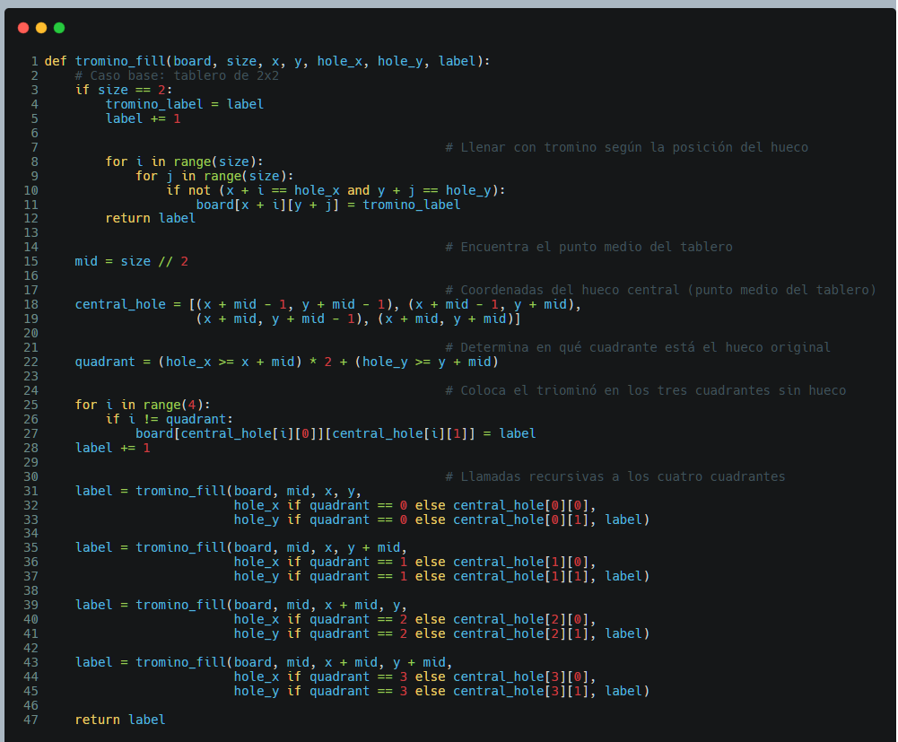

# Resolución de problemas con algoritmos

Las siguientes técnicas nos van a ayudar a la resolución de problemas con algoritmos:

- [I   - El Enfoque Greedy](#i---el-enfoque-greedy)
- [II  - La Estrategia dividir y conquistar](#ii---la-estrategia-dividir-y-conquistar)
- [III - Programación Dinámica](#iii---programación-dinámica-dynamic-programming)
- [IV  - Backtraking](#iv---backtracking)

## I - El Enfoque Greedy

### ¿Que es el Enfoque Greedy?

El Enfoque Greedy es una técnica de diseño de algoritmos que llega a una solución seleccionando la opción “mejor” en el momento entre una secuencia de opciones según criterios predefinidos.

Es una técnica de diseño de algoritmos muy eficiente y simple para resolver problemas de optimización, como el problema del cambio de monedas y el problema de selección de actividades. 

El Enfoque Greedy resuelve el problema en los tres pasos siguientes:

- **Proceso de selección**: elegir el siguiente elemento que se agregará al conjunto.
- **Comprobación de viabilidad**: comprobar si un nuevo conjunto es adecuado para ser la respuesta.
- **Comprobación de la solución**: determinar si un nuevo conjunto es la respuesta al problema.

### Aplicando el Enfoque Greedy

Basado en los pasos principale del **Enfoque Greedy**, al tratar de resolver un problema seleccionando siempre la opción que parece ser la mejor en cada paso, sin preocuparse por si esta elección local es la mejor globalmente. Aplicaremos la esencia de estos pasos el caso de dar cambio con monedas, el algoritmo debe seguir estas reglas:

1. **Seleccionar la moneda más grande disponible**: En cada iteración, el algoritmo intenta usar la moneda de mayor valor posible (esto es el comportamiento clave del **Enfoque Greedy**).
2. **Restar el valor de la moneda seleccionada del monto pendiente**: Después de elegir la moneda más grande posible, se resta de la cantidad total de cambio que aún debe darse.
3. **Continúar el proceso hasta que se devuelva el cambio exacto** o ya no queden monedas disponibles que permitan seguir reduciendo el monto.

El siguiente codigo incorpora un diccionario, para saber por clave, valor, (clave: moneda, valor: cantidad de moneda), las monedas que se van dando y si es posible con el monto a devolver y las monedas disponibles dar dicho cambio.

#### Escenario

En el problema de **cambio de monedas**, supongamos que hay monedas diferentes denominaciones y que debe usar para dar cambio, pero cuenta con monedas limitadas, es decir tiene un monto fijo como suma total de la monedas destinadas para dar cambio. Deberá, escribir la salida de cómo el algoritmo `coin_change2()` determinará el cambio para una suma N dada.

La tarea consiste en utilizar una combinación de diferentes denominaciones de monedas, que incluyen 10 won, 100 won, 200 won  y 500 won.

El algoritmo `coin_change2()` calculará cuántas de cada tipo de moneda se necesitan para alcanzar exactamente una uma N dada, optimizando así la distribución del cambio.

#### Codificación propuesta

Programa principal que llamará a la función

Si con las monedas que hay en el **wallet**, no podemos dar cambio, dirá que no se puede, o por el contrario si se puede dar el cambio, dirá, cuales monedas a usado para darlo.

Con el **`print()`** de la *línea 13* en la función **`coin_change2()`**,  mostraremos como quedan las monedas una vez que se han utilizado para el cambio, hasta el final, el resultado de la función es determinar si se puede dar el cambio con las monedas disponibles, y como se han usado para hacerlo. En caso contrario no se podrá dar el cambio.

## II - La Estrategia dividir y conquistar

### ¿ Cuál es la Estrategia dividir y conquistar?

La **Estrategia dividir y conquistar** divide la instancia de entrada de un problema dado en dos o más instancias de entrada más pequeñas.
Si la respuesta a la instancia de entrada dividida no se puede obtener de inmediato, se dividirá nuevamete en instancias de entrada más pequeñas aún.
Si has obtenido la respuesta a la instancia de entrada dividida, puedes integrar esta respuesta para encontrar la respuesta a la instancia de entrada original.

El método de **Dividir y conquistar** es una estrategia para resolver problemas en los siguientes pasos.

- **Dividir:** Divide la instancia de entrada del problema en dos o más instancias de entrada más pequeñas.
- **Conquistar:** Resuelve cada una de las instancias de entrada divididas. Si la instancia dividida no es lo suficientemente pequeña, utiliza la recursión para resolverla.
- **Combinar:** Si es necesario, encuentra la respuesta de la instancia de entrada original combinando las respuestas de las instancias de entrada pequeñas.

### 1. Aplicación del método Dividir y conquistar en la solución de encontrar la moneda mas pesada

Seguiremos los siguientes pasos para su aplicación en la resolución de este ejercicio:

1. **Dividir en dos grupos**: Dividir el conjunto de monedas en dos mitades, izquierda y derecha.
2. **Llamar recursivamente**: En cada mitad, buscamos recursivamente la moneda más pesada hasta llegar al caso base (una sola moneda la más pesada).
3. **Combinar**: Cuando tengamos la moneda más pesada de cada mitad, las comparamos (combinando los resultados) entre sí para encontrar la más pesada de las dos.

#### Codificación propuesta

### 2. Aplicación del método Dividir y conquistar en la solución del triominó en un tablero de NxN

1. **División del Problema**: El tablero se divide en cuadrantes más pequeños de manera recursiva, comenzando con un tablero completo de tamaño **2^n**.  En cada paso, se reduce el tamaño del problema a la mitad (es decir, cada cuadrante es de tamaño **`n/2`**).
2. **Identificación del Caso Base**: *El caso base* es un tablero de 2x2, donde se puede colocar un único triominó para cubrir tres de las cuatro casillas. Si uno de estos cuadrantes contiene el hueco o "X", las demás casillas del **2x2** se rellenan con un triominó.
3. **Conquista Recursiva**: Cada cuadrante se resuelve de manera recursiva. Si un cuadrante contiene el hueco original, se rellena con triominós de forma que las otras tres casillas en el centro de los cuadrantes se cubren con un triominó adicional. Luego, cada cuadrante se trata como un nuevo subproblema.
4. **Combinación de Soluciones**: Una vez que los cuatro cuadrantes se llenan (cada uno resolviendo su subproblema), se combinan para formar el tablero completo, cubierto con triominós excepto en la casilla donde estaba el hueco inicial.
5. **Asignación de Etiquetas**: A medida que se colocan triominós en el tablero, se asignan etiquetas diferentes para distinguir cada triominó en el tablero completo, lo cual facilita la visualización del patrón de cobertura.

El enfoque **Dividir y conquistar** permite descomponer el problema del llenado del tablero con triominós en subproblemas más pequeños hasta que cada uno pueda resolverse de manera simple, y luego combinar las soluciones parciales para obtener la solución final.

#### Codificaciónpropuesta

**Función trómino_fill**

**Funciones secundarias**

**Programa principal**

## III - Programación Dinámica (Dynamic Programming)

### ¿Qué es Programación Dinámica?

La programación dinámica es una técnica de diseño de algoritmos que analiza las características recursivas de un problema dado y luego obtiene una respuesta en una solución de forma ascendente (bottom-up).
 En este caso, la técnica de almacenar las respuestas a los subproblemas solapados en una tabla para resolver el problema de subproblemas solapados se llama **memoización**.

El procedimiento de desarrollo del algoritmo de **Programación Dinámica** es el siguiente:

- La respuesta al caso de entrada completo se obtiene mediante un método ascendente (bottom-up) que resuelve primero los casos de entrada pequeños.

- Establecer una ecuación recursiva para calcular la respuesta al caso de entrada del problema.

La programación dinámica utiliza **memoización** para los cálculos ascendentes (bottom-up).

- Las respuestas a los subproblemas se almacenan en una tabla (o memoria).

- Cuando se encuentra el mismo subproblema, se toma directamente de la tabla (o memoria) sin volver a calcular.

### 1. Aplicando la técnica de Programación dinámica en la solución de la maxima suma de subarreglos

Aplicaremos la  Programación Dinámica para resolver el problema de encontrar la **máxima suma de subarreglos** (Maximum Subarray Problem). 

Los pasos mas importantes para su aplicación son:

1. **Subproblemas**: El problema principal se divide en pequeños subproblemas. En este caso, el subproblema es calcular la suma máxima que se puede obtener considerando los elementos hasta la posición actual en el arreglo.

2. **Relación Recursiva**: La relación que se establece es que, en cada paso, se compara si es más beneficioso:

   - Continuar con el subarreglo sumando el elemento actual al máximo subarreglo anterior (es decir, sumarlo a `maxcurrent`).
   - O comenzar un nuevo subarreglo desde el elemento actual, si este es mayor que la suma anterior.

   La ecuación recursiva es:
   
   $$
   maxcurrent=max⁡(nums[i],maxcurrent+nums[i])
   $$

   Donde `maxcurrent` es la mejor suma que se puede obtener al incluir el elemento actual.

4. **Almacenamiento de Subproblemas (Memoización)**: No se recalculan los subproblemas ya resueltos. Aunque no se usa una tabla explícita, la variable `maxcurrent` almacena la solución parcial hasta el índice actual, evitando cálculos repetidos.

5. **Optimización Ascendente (Bottom-Up)**: El algoritmo comienza desde el primer elemento del arreglo y progresa hacia adelante, resolviendo primero los casos más pequeños (subarreglos de longitud 1, luego 2, etc.), hasta cubrir todo el arreglo.

6. **Resultado Final**: Se almacena la mejor solución global en `max_global`, que contiene la suma máxima del subarreglo encontrado hasta el momento, y se actualiza cada vez que se encuentra un subarreglo con una suma mayor.

#### Escenario

> Dado un arreglo unidimensional sucesivo de **n** enteros, escribe un algoritmo que encuentre cuándo la suma de valores sucesivos en el arreglo es máxima.

Este enunciado está planteando el problema de identificar el punto en el que la suma de valores consecutivos en un arreglo alcanza su máximo.

#### Codificacion propuesta

**Función para calcular la suma de valores sucesivos máximos en un arreglo**

**Programa principal**

## IV - Backtracking

### ¿Que es Backtracking?

El retroceso o **Backtracking** es una estrategia útil de diseño de algoritmos que construye de manera incremental una solución candidata y retrocede tan pronto como determina que la solución candidata no puede llevar a una solución válida.

El **Backtracking** resuelve problemas siguiendo el siguiente proceso:

- Organizar el espacio de búsqueda en forma de un árbol.
- Explorar el árbol del espacio de búsqueda mediante una búsqueda en profundidad (Depth-first search).
- Retroceder cuando ya no es prometedor.

El Backtracking utiliza la técnica de poda (**pruning**) de la siguiente manera:

- Pruning La poda se refiere a retroceder sin visitar nodos en el subárbol que no son prometedores.
- Prometedor se refiere a un estado en el que puede existir una solución en el subárbol del nodo que se está visitando actualmente.

### 1. Aplicando la técnica de Backtraking en la resolución de la Asignación de Números a Letras para Formar Cuadrados Perfectos en una Frase

- **Organización del espacio de búsqueda en forma de un árbol**:

  - Cada letra de la frase "A MERRY XMAS TO ALL" representa un nodo en el árbol. El objetivo es asignar un número a cada letra, de manera que se cumplan las condiciones del problema.

  - El espacio de búsqueda se organiza en todas las posibles asignaciones de números a letras. Las letras "T" y "O" ya tienen sus valores (8 y 1, respectivamente), reduciendo el espacio de búsqueda.

- **Búsqueda en profundidad (DFS)**:

  - Se utiliza una búsqueda en profundidad para explorar todas las combinaciones posibles de asignaciones numéricas a las letras restantes.

  - La función `itertools.permutations` genera todas las posibles combinaciones de dígitos para las letras no conocidas (diferentes de T y O). Esto es equivalente a recorrer el árbol de decisiones de manera **recursiva**, intentando todas las asignaciones posibles de números a letras.

- **Retroceso (Backtracking) cuando la solución no es prometedora**:

  - Una vez que se hace una asignación de números a letras, se verifica si esa combinación cumple con las restricciones del problema:
    - Si el número de cada palabra es un **cuadrado perfecto** (`is_square`).
    - Si la suma de las cifras de cada número también es un **cuadrado perfecto** (`sum_of_digits_is_square`).

  - Si una combinación no cumple con estas restricciones, el algoritmo **retrocede** (poda "pruning") y explora la siguiente combinación de asignaciones de números a letras.

  - Este proceso de retroceso asegura que no se exploren ramas del árbol que no sean prometedoras, es decir, aquellas que no puedan conducir a una solución válida.

- **Poda (Pruning)**:

  - Cuando se detecta que una asignación de números a letras no es prometedora (no cumple con las condiciones de ser un cuadrado perfecto), el algoritmo **no sigue explorando esa rama** del árbol de decisiones.

  - Esto se realiza al comprobar la validez de cada palabra en la asignación actual. Si alguna palabra no cumple las condiciones, el ciclo se interrumpe (`break`), descartando esa asignación completa.

- **Solución válida**:

  - Si se encuentra una asignación que satisface todas las condiciones, el algoritmo devuelve esa asignación como solución válida.

  - En caso de no encontrar ninguna solución válida, el algoritmo indica que no se encontró ninguna solución.

#### Escenario

El problema consiste en asignar un número a cada letra de la frase **`"A MERRY XMAS TO ALL"`**, de forma que la suma de los números en cada palabra sea un cuadrado perfecto. Además, cada palabra debe estar formada por números cuyas cifras individuales sumen también un cuadrado perfecto. 

Sabemos que T = 8 y O = 1.

Para resolverlo, se debe asignar un número específico a cada letra cumpliendo estas condiciones.

#### Codificacion propuesta

**Funciones principales**

**Funciones auxiliares**

**Programa principal**

### 2. Aplicando la técnica de Backtraking en la resolución de un laberinto representado como una matriz binaria de N x N

- **Organizar el Espacio de Búsqueda en Forma de un Árbol**

  El **espacio de búsqueda** en este problema son todas las posibles posiciones que el ratón puede visitar en el laberinto. En cada paso, el ratón puede intentar moverse en cuatro direcciones: **derecha**, **abajo**, **izquierda** y **arriba**.

  Cada celda `(x, y)` en la matriz se puede considerar un nodo en el árbol de búsqueda. Desde un nodo, puedes moverte a uno de los cuatro posibles vecinos (siempre que sea un camino válido, es decir, una celda con el valor **0**).

  El **árbol de búsqueda** comienza en `(0, 0)` y termina en `(N-1, N-1)`. Cada rama del árbol representa una secuencia de movimientos del ratón en el laberinto.

- **Explorar el Árbol del Espacio de Búsqueda Mediante una Búsqueda en Profundidad (DFS)**

  La función `dfs(x, y)` implementa una **búsqueda en profundidad**. En este proceso:

  - Comenzamos desde la celda inicial `(0, 0)`.
  - A partir de la celda actual `(x, y)`, intentamos movernos en las cuatro direcciones posibles.
  - En cada movimiento, verificamos si la celda es **segura** (es decir, que sea un camino válido y no se haya visitado previamente).
  - Si la celda es válida, marcamos la celda como parte del **camino** (la solución parcial) y continuamos explorando desde esa celda.
  - Si alcanzamos la celda objetivo `(N-1, N-1)`, terminamos la búsqueda.

- **Retroceder (Backtracking) Cuando ya no es Prometedor**

  Si en algún punto el ratón no puede moverse a ninguna de las celdas vecinas (todas son paredes, ya fueron visitadas o están fuera de los límites), el algoritmo **retrocede**:

  - Esto se implementa cuando la función `dfs(x, y)` devuelve `False`, lo que indica que no es posible avanzar desde la celda actual.
  - Al retroceder, la celda actual se desmarca como parte de la solución (`solution[x][y] = 1`), y el algoritmo prueba otra dirección o regresa a una celda anterior para explorar otra rama del árbol de búsqueda.
  - Esto asegura que no se exploren caminos que no lleven a la solución.

- **Poda (Pruning)**

  La **poda** ocurre en este contexto cuando descartamos caminos no prometedores tan pronto como sea posible, evitando seguir explorando subárboles completos que no llevarán a la solución. 

  - Cada vez que la celda actual `(x, y)` no es válida (porque es una pared, ya fue visitada o está fuera de los límites), el algoritmo **poda esa rama** y retrocede.
  - También, si un movimiento desde `(x, y)` no conduce a una solución (las cuatro direcciones no son válidas o llevan a callejones sin salida), esa rama se termina sin explorar más.

#### Escenario

En este escenario, tenemos un **laberinto representado como una matriz binaria de N x N**. Los elementos de la matriz pueden ser:

- **0**: Representa un camino por el cual el ratón puede moverse.
- **1**: Representa una pared o un obstáculo que el ratón no puede atravesar.

El objetivo es encontrar un camino desde la esquina superior izquierda de la matriz (0, 0) hasta la esquina inferior derecha (N-1, N-1), moviéndose únicamente por celdas con un valor de **0**.

El problema requiere una solución que utilice la técnica de **búsqueda en profundidad (DFS)** con **backtracking** para encontrar una ruta válida en el laberinto. Si el ratón llega a un callejón sin salida, debe retroceder (backtracking) hasta encontrar una ruta alternativa, si la hay.

#### Codificación propuesta

**Función principal**

**Programa principal**

